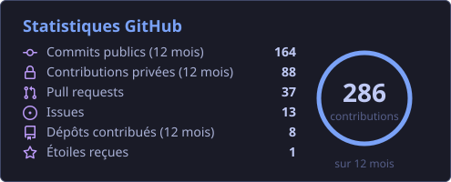
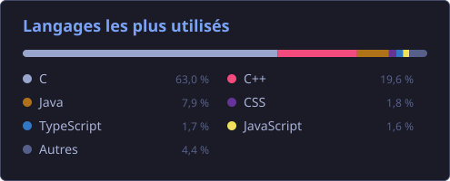
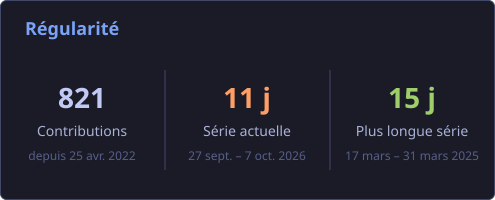

 

 

## À propos

Étudiant en L3 Informatique à l'Université du Mans. Je construis des moteurs de rendu, des jeux et des apps web — rarement l'un sans l'autre.

> 🔎 Je cherche une **alternance de 2 ans à partir de septembre 2027** en développement logiciel système, embarqué ou moteur de jeu.

- **Dechu** : moteur de jeu 2D en C++20 (OpenGL 4.5, SDL3, ECS, simulation et rendu sur deux threads), chef de projet d'une équipe de 4
- Moteur Vulkan avec PBR, shadow mapping et frustum culling
- Jeux en C/SDL2 ([ICPocket](https://github.com/Lounol72/ICPocket), chef de projet), C++/SDL3, Java et Unity
- Apps web Angular et Next.js, et un portfolio auto-synchronisé depuis l'API GitHub
- Éditeur de texte modal en C avec keybindings Vim — parce que pourquoi pas
- Neovim (3 configs actives) et Doom Emacs, sous Linux

 

## Stack

**Langages**

**Moteurs & Graphisme** · Vulkan · OpenGL · SDL

**Web**

**Outils**

 

## Statistiques GitHub

 

## Portfolio

Mon portfolio regroupe mes projets universitaires, personnels et de game jam, mis à jour automatiquement depuis l'API GitHub.

**[lounol72.github.io/Lounol72](https://lounol72.github.io/Lounol72/)** · [CV (PDF)](https://lounol72.github.io/Lounol72/assets/cv/Louis_Subtil_CV.pdf)

